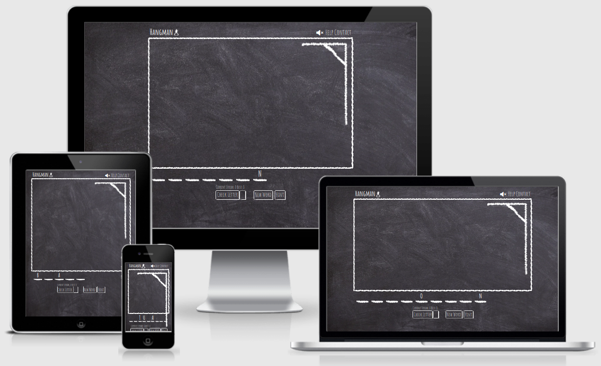

# HANGMAN INTERACTIVE CHALKBOARD GAME

Hangman Interactive Chalkboard game is an online version of the pen and paper game Hangman. It uses the words API to get a random word and to provide hints for the user. The game is designed to be entertaining and to broaden the players vocabulary.

## User Experience (UX)

- ### User stories

  - #### First Time Visitor Goals

    1. As a First Time Visitor, I want to easily understand the main purpose of the site and to easily learn about the game if unfamiliar with it.
    2. As a First Time Visitor, I want to be able to easily navigate throughout the page to find content.
    3. As a First Time Visitor, I want to be able to easily find and understand the controls of the game.

  - #### Returning Visitor Goals

    1. As a Returning Visitor, I want to be able to immediatly play the game without the need for tutorials.
    2. As a Returning Visitor, I want to find contact information.

- ### Design
  - #### Colour Scheme
    - The main colour used throughout is white to mimic the look of vhalk on a board.
  - #### Typography
    - The Amatic SC font is the main font used throughout the game with cursive as the fallback font in case the font isn't being imported into the site correctly. These are used to mimic the look of natural hand writing.
  - #### Imagery
    - Imagery used to make up the drawings of the stickman and dashes under the letters was designed to mimic chalk on board.
  - #### Wireframe
    - This wireframe was used initially to get an idea of the style and layout of the page would be:
      [Wireframe Screenshot](./assets/media/ci-p-2-hangman.png)

## FEATURES

### EXISTING FEATURES

- **Instructional Message**
  - On landing on the page initially or when the page is refreshed there is an instructional message displayed with the loading wheel to make clear the purpose of the game.
    
